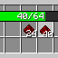

# BetterSplitStack
  
A utility mod for Minecraft, granting precise control over splitting item stacks.  
Drag right mouse button on a stack of items to set count. Then release to pickup that count of items.  
This mod needs to be on both client and server side to work.  